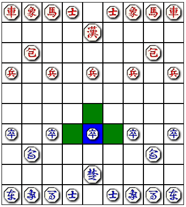

# Half-Stack Janggi Web App

This project web app converts my Janggi game portfolio project ([Janggi-Game](https://github.com/taylnath/janggi-game)) to a web app, with no changes to the original Python Janggi game. The front end is React, and tracks its own version of game state. The back end is Flask, with the Janggi Game as a file-based session variable. When you click on spots on the board, (depending on where you click) the board 
sends a request to the Flask server, which then responds with information about possible moves. The React frontend provides you with some 
details about the game status, and highlights potential moves. 

You can play the game here: [Janggi-Web on Heroku](https://evening-shelf-05687.herokuapp.com/). It may take a minute to load 
at first if the Heroku Dyno is sleeping. 

The initial board:

After selecting one of Blue's pieces:

After moving that piece:

The game status (this status is from later on in the game):

Status fields are:
- System: "ready" if the system is at rest, waiting for your move. "processing" if it is waiting for a response from the server. 
- Player: The current player. 
- Game: Current state of the game ("UNFINISHED", "RED WON" or "BLUE WON").
- The in-check status tells if one of the players is in check.
- There is another field for general messages (i.e. you selected a 
space with no piece).

## Issues / TODO
- Currently the React app doesn't check if it's state matches that of the server -- it just updates as it goes. This 
can cause it to have a different state from the server version, for example if the page gets refreshed but the session 
is the same. Possible fixes: make a new game on refresh, or (much better) verify with the server that board state is correct.
- The board background is missing.
- Not responsive on mobile. Things to fix: resize state window on small screens, get rid of "phantom" images after a piece moves out of a square. 
- History / Back button / Saved games.
- Checkmate hints (i.e. which move to get out of checkmate).